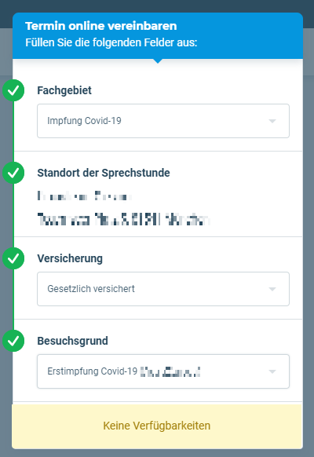
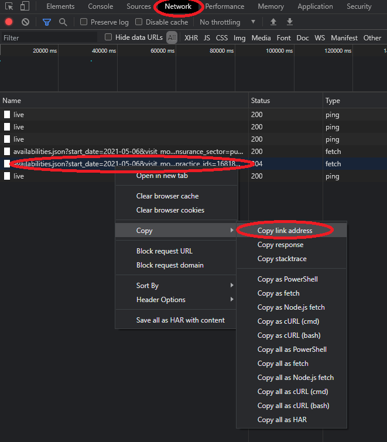

## Description

The goal of this tool is to get an early notification about available vaccination appointments on Doctolib.

## Dependencies

[discord_webhook](https://pypi.org/project/discord-webhook/)

## Usage

1. Find a praxis on [doctolib](https://www.doctolib.de) providing the required vaccination. (-> `$ORIGINAL_URL`).
1. Open your browser's debug console (Chrome was used in the example).
1. Try to get an appointment.  

1. Find the URL requesting the available appointments (-> `$URL`).  

1. At the `urls = ` you can add any `$URL` to check for appointments.
1. At the `original_urls[urls[X]] = ` you need to add the `$ORIGINAL_URL`s. It is only necessary to receive the URL you need to click on in discord to reserve the appointment.
1. Set your [discord webhook](https://support.discord.com/hc/en-us/articles/228383668-Intro-to-Webhooks) to get notfied ASAP: `discord_webhook_url = #WEBHOOK_URL`
1. Set the timeout betweenb two requests: `sleep_between_requests = 30 # [s]`
1. Run `doctolib_imfung_finder.py`
